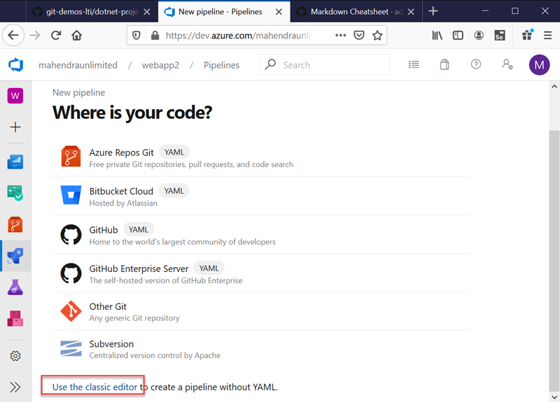
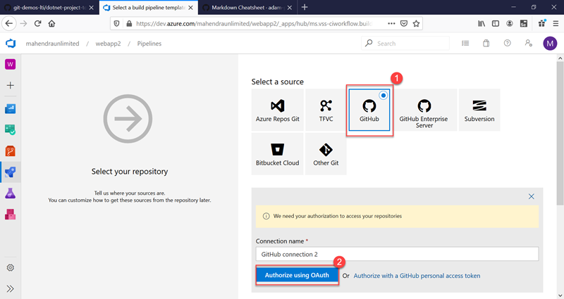
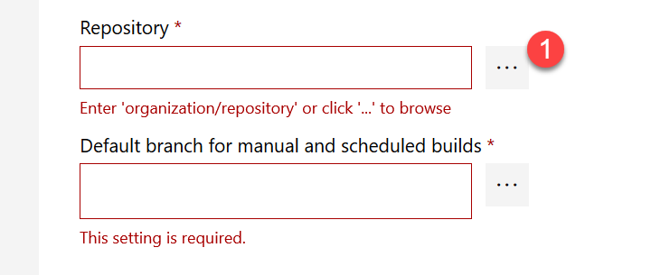
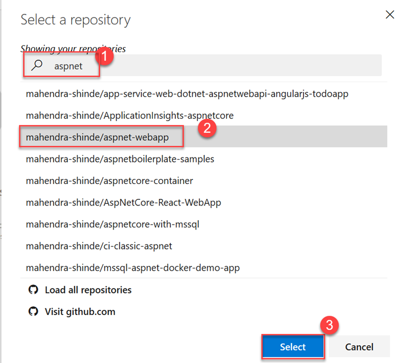
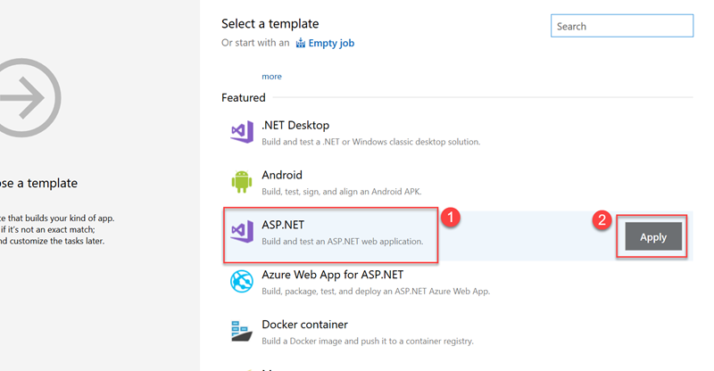
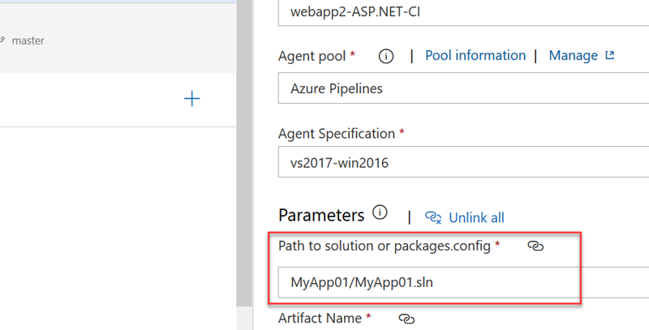
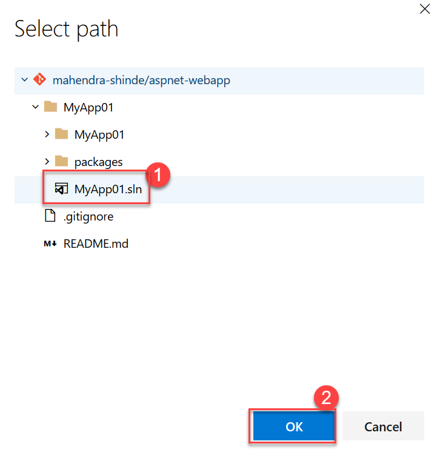
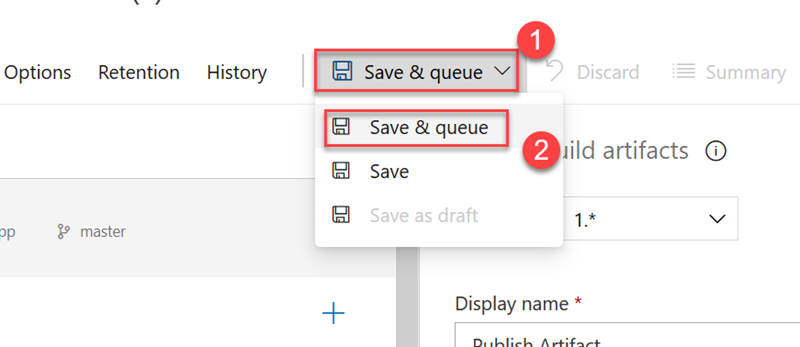
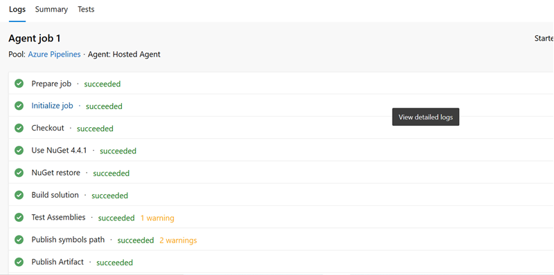

## Build project from GitHub on Azure DevOps

1.  Sign in on dev.azure.com
2.  Create new PUBLIC project 
3.  Goto `Azure Pipelines` and click on `New Pipeline`
4.  Choose link `Use Classic Editor` (At the bottom of page).

5. Choose Source control "GitHub" and then Use "Authorize using GitHub" button (You need your GitHub User credentials)

6.  Now, choose your repository name and branch

7. Choose from template "ASP.NET" and click "Apply"

8.  IN First screen locate option `Path to solution or package.config` and use '...' button to choose .sln file.  

9.  Choose the Solution 

10. Finally use `Save & Queue` button to test FIRST build for this pipeline.

11. The Output should be:

